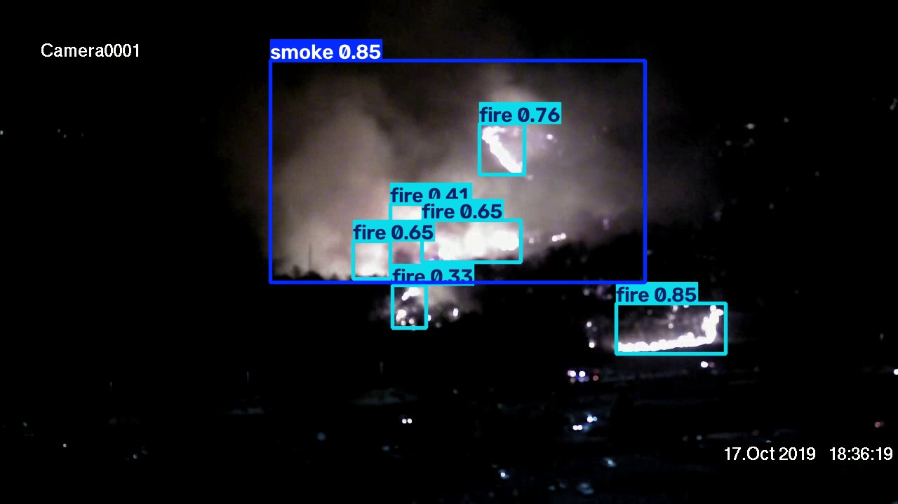
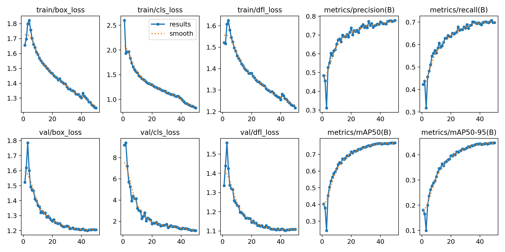
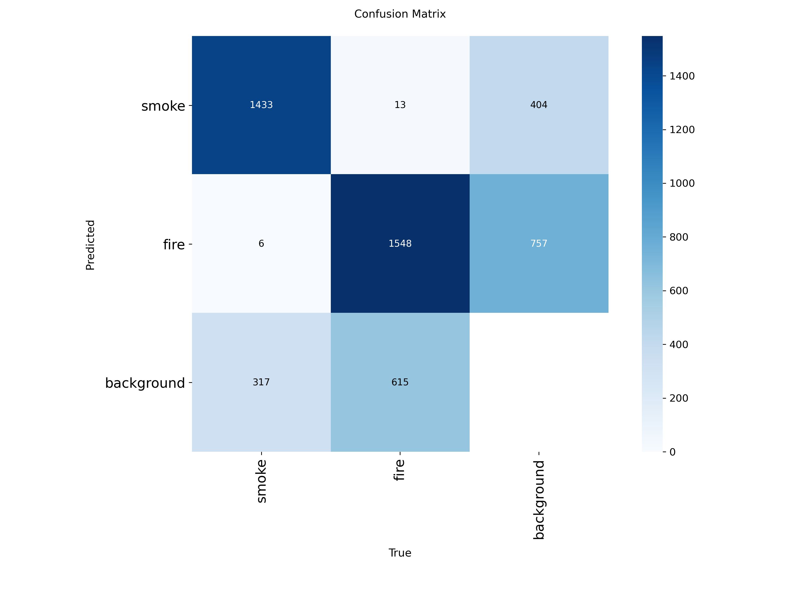
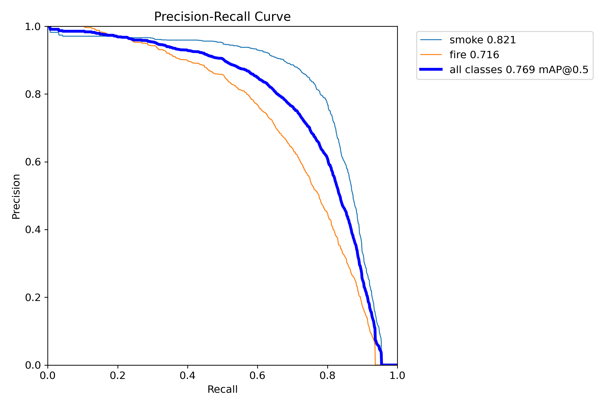
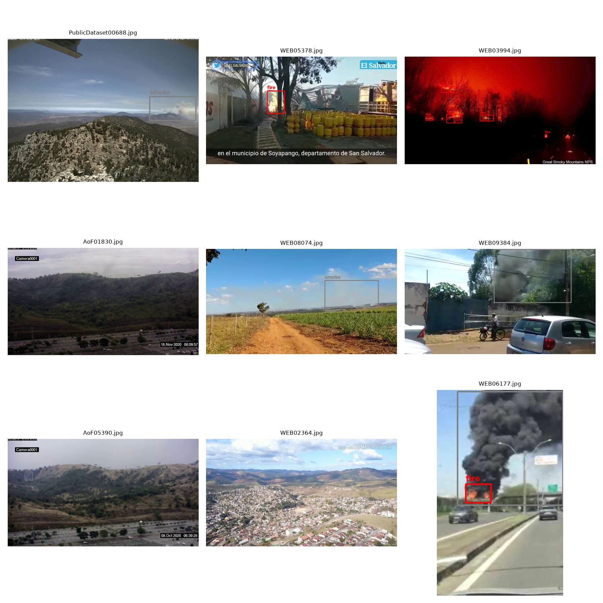
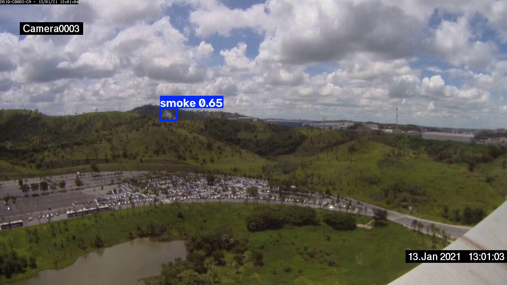
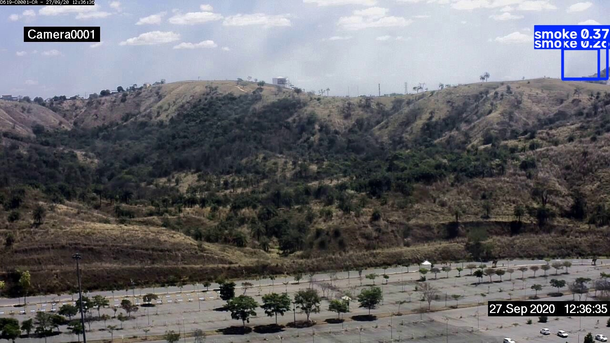

# 🔥 Fire & Smoke Detection using YOLOv8

A real-time fire and smoke detection system built by fine-tuning YOLOv8 on the D-Fire dataset (21,527 images). Trained end-to-end — from dataset annotation verification through GPU training to held-out test evaluation and live inference on images and video.


*Nighttime CCTV frame — model correctly identifies 6 distinct fire clusters and 1 smoke region in a single scene.*

---

## 🎯 Problem Statement

Early fire and smoke detection is critical for wildfire response, industrial safety monitoring, and surveillance-based early warning systems. Traditional smoke detectors are prone to false alarms and can't localize or quantify a fire visually. This project trains a lightweight, deployable object detection model that identifies **fire** and **smoke** separately in images and video streams — suitable for CCTV integration or edge deployment.

---

## 📊 Results

Evaluated on a held-out **test set** (4,306 images) the model never saw during training or validation:

| Metric | Overall | Smoke | Fire |
|---|---|---|---|
| Precision | 0.780 | 0.832 | 0.728 |
| Recall | 0.685 | 0.767 | 0.603 |
| **mAP50** | **0.765** | 0.829 | 0.700 |
| mAP50-95 | 0.439 | 0.508 | 0.370 |

This result matches/exceeds a comparable publicly reported YOLOv8n model fine-tuned on the same D-Fire dataset (mAP50: 0.754), validating that the training pipeline is sound.

**Key observation:** Smoke detection consistently outperforms fire detection across all metrics. This is expected — smoke regions tend to be large and diffuse with distinct gray/white coloring, while flames are smaller, more variable in shape, and can visually blend with bright or warm-toned backgrounds (sunsets, artificial lighting).

**Training vs. test consistency:** Validation mAP50 during training (0.769) is nearly identical to the final test mAP50 (0.765) — indicating the model generalized well rather than overfitting to the training data.

### Training curves & confusion matrix
| Training Results | Confusion Matrix |
|---|---|
|  |  |

### Precision-Recall Curve


---

## 🗂️ Dataset

**[D-Fire Dataset](https://github.com/gaiasd/DFireDataset)** — 21,527 real-world images annotated in YOLO format.

| Split | Images | Fire boxes | Smoke boxes | Empty (negative) images |
|---|---|---|---|---|
| Train | 14,122 | 9,638 | 7,794 | 6,458 |
| Val | 3,099 | 2,176 | 1,756 | 1,375 |
| Test | 4,306 | 2,875 | 2,311 | 2,005 |

Roughly **46% of images are hard negatives** (fires-that-aren't: sunsets, warning signage, red/orange lighting) — deliberately included so the model learns not to false-positive on color alone.

**Data integrity verification** (see `src/data/verify_annotations.py`): 0 missing labels, 0 orphan label files across all 21,527 images. 4 test-set labels with out-of-bounds coordinates (0.09% of test set) were automatically excluded during evaluation.


*Sample training images with ground-truth YOLO annotations, verified for correct box alignment before training.*

---

## 🏗️ Model & Training

- **Architecture:** YOLOv8n (nano) — 3M parameters, chosen for fast inference and edge-deployment feasibility
- **Training hardware:** Google Colab (free tier), Tesla T4 GPU
- **Epochs:** 50 (early stopping patience: 15, not triggered — model trained the full schedule)
- **Image size:** 640×640
- **Batch size:** 16
- **Training time:** 3.67 hours
- **Optimizer:** AdamW (auto-selected by Ultralytics), lr0=0.001667

Full training run is documented in [`notebooks/01_train_yolov8_fire_smoke.ipynb`](notebooks/01_train_yolov8_fire_smoke.ipynb).

### 📥 Download trained weights

The trained model (`best.pt`, 6.23 MB) is hosted on Hugging Face Hub:

**[huggingface.co/Farhatullah0066/yolov8n-fire-smoke-detection](https://huggingface.co/Farhatullah0066/yolov8n-fire-smoke-detection)**

```python
from huggingface_hub import hf_hub_download
from ultralytics import YOLO

weights_path = hf_hub_download(
    repo_id="Farhatullah0066/yolov8n-fire-smoke-detection",
    filename="best.pt"
)
model = YOLO(weights_path)
```

---

## 📁 Project Structure

```
fire-smoke-detection-yolov8/
├── configs/
│   └── data.yaml                  # YOLO dataset config
├── data/
│   └── DATA_CARD.md               # Dataset documentation
├── notebooks/
│   └── 01_train_yolov8_fire_smoke.ipynb   # Full Colab GPU training run
├── src/
│   ├── data/
│   │   ├── download_dataset.py    # Kaggle dataset download
│   │   ├── verify_annotations.py  # Label integrity checks
│   │   └── visualize_samples.py   # Ground-truth box visualization
│   ├── training/
│   │   └── train.py               # YOLOv8 training script (CPU/GPU)
│   ├── evaluation/
│   │   └── evaluate.py            # Test-set evaluation (mAP, P, R)
│   └── inference/
│       ├── predict_image.py       # Single-image inference
│       └── predict_video.py       # Video inference
├── results/
│   ├── plots/training_run/        # Training curves, confusion matrix
│   └── predictions/image_run/     # Sample model predictions
└── requirements.txt
```

---

## 🚀 Usage

### Setup

```bash
python -m venv venv
venv\Scripts\Activate.ps1        # Windows
pip install -r requirements.txt
```

### Run inference on an image

```bash
python src/inference/predict_image.py --weights models/best.pt --source path/to/image.jpg
```

### Run inference on a video

```bash
python src/inference/predict_video.py --weights models/best.pt --source path/to/video.mp4
```

### Evaluate on the test set

```bash
python src/evaluation/evaluate.py --weights models/best.pt --data data/raw/data.yaml --split test
```

### Verify dataset integrity

```bash
python src/data/verify_annotations.py
```

---

## 🔍 Sample Predictions

| Detection | Confidence |
|---|---|
|  | Smoke: 0.65 |
|  | Smoke: 0.37, 0.26 (distant/subtle smoke — harder case) |

---

## 🔬 Limitations & Future Work

- **mAP50-95 (0.439) is notably lower than mAP50 (0.765)** — fire/smoke have irregular, non-rigid boundaries, making tight bounding-box localization inherently harder than rigid objects (cars, faces). Future work could explore instance segmentation instead of bounding boxes for more precise localization.
- **Fire detection recall (0.603) trails smoke recall (0.767)** — likely addressable with additional hard-negative mining on bright/warm-toned false-positive-prone scenes (sunsets, artificial lighting).
- Model was trained on a fixed 640px resolution; a multi-scale training pass could improve detection of small, distant fire sources.
- Next step: deploy as a lightweight Hugging Face Spaces demo for live browser-based testing.

---

## 📜 Acknowledgments

- **Dataset:** [D-Fire](https://github.com/gaiasd/DFireDataset) by Pedro Vinícius Almeida Borges de Venâncio et al. (GAIA, Solutions on Demand)
- **Framework:** [Ultralytics YOLOv8](https://github.com/ultralytics/ultralytics)
- Trained on free Google Colab GPU resources

## 📄 License

This project is released under [AGPL-3.0](LICENSE), consistent with the Ultralytics YOLOv8 license.